# Asset Tracking Example for STM32U5xx with HTTPS using STEVAL-NBIOTV1

This application demonstrates how to use ST Asset Tracking dashboard ([dsh-assetracking.st.com](https://dsh-assetracking.st.com/)) over a cellular network using [STEVAL-NBIOTV1](https://www.st.com/en/evaluation-tools/steval-nbiotv1.html) development kit.
It simulates an asset tracking device that periodically sends sensor data and GPS location to the ST Asset Tracking dashboard using HTTPS protocol.

## How to use this application

### Hardware configuration

Unless you have specific requirements, STEVAL-NBIOTV1 power supply configuration should be set as follows:
- J1: 1-2 CLOSED
- J2: 1-2 CLOSED

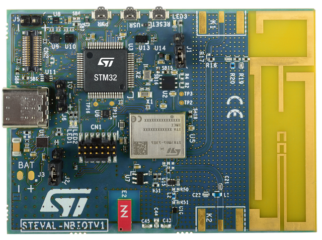

Connect the STLINK-V3 to CN1 connector on the STEVAL-NBIOTV1 board.

*Note: The STLINK will be used both to program the board from STM32CubeIDE and to monitor the UART output.*

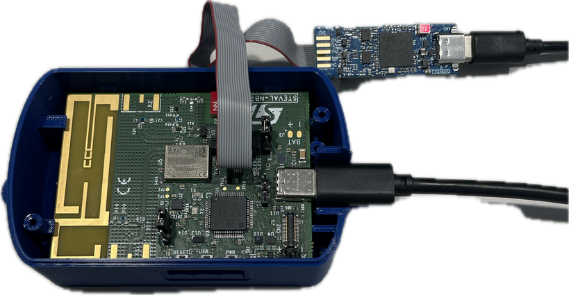

Connect a USB-C cable to the STEVAL-NBIOTV1 to power up the board (the battery is not needed).

Open the project with STM32CubeIDE, build, and flash the application to the STEVAL-NBIOTV1 board.

You can monitor the application output using a serial terminal (e.g., PuTTY, Tera Term) configured with the following settings:
- **Port:** COMx (where x is the port number assigned to the STLINK Virtual COM)
- **Baud Rate:** 921600
- **Data Bits:** 8
- **Stop Bits:** 1
- **Parity:** None

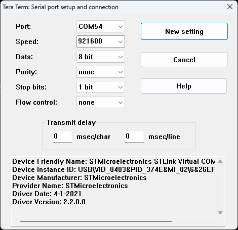

### Dashboard configuration

Go to [dsh-assetracking.st.com](https://dsh-assetracking.st.com/) and login with a MyST account, you can create it if you don't have one.

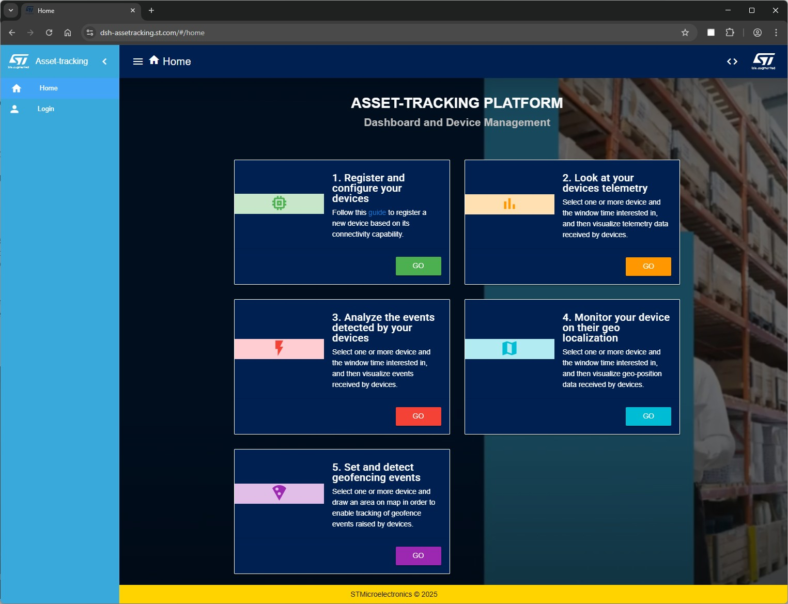

Go to Settings -> API Keys and create a new key for your application (click on the "+" button to create the key).
The API key value will need to be copied in the STM32 firmware code later (redefine the `HTTP_AUTH` macro).

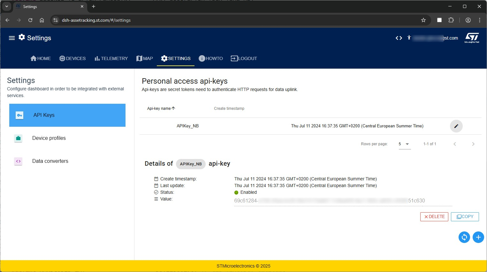

In order to add a new device to the dashboard, go to **DEVICES** and click on the "**+**" button to add a new device.

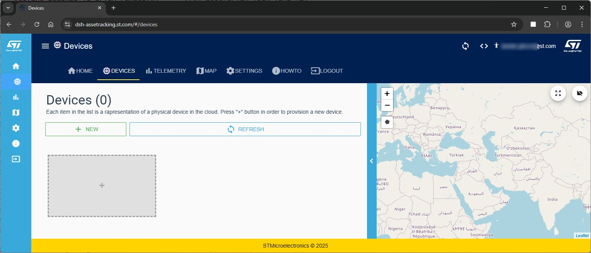

Select **NBIoT** as device type 

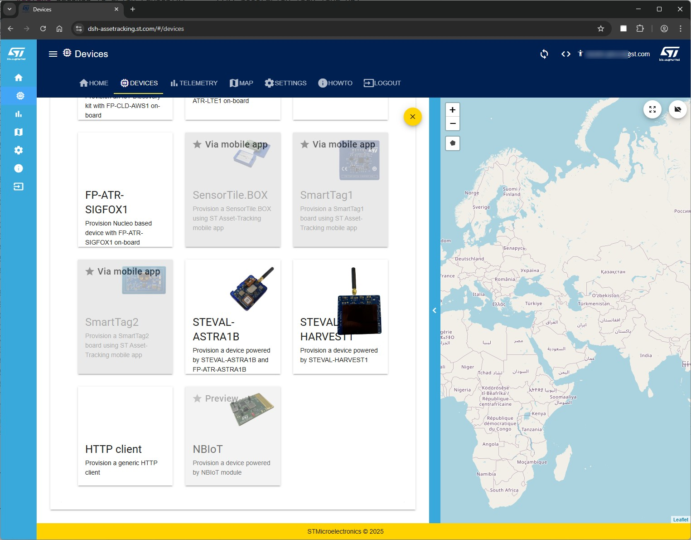

Fill in the device information:
- **Device ID:** choose a unique name for your device (this will need to be copied in the STM32 firmware code later (redefine the `DASHBOARD_DEVICE_ID` macro).
- **Label:** human friendly name for your device

Click **NEXT** and then **Submit** to create the device.

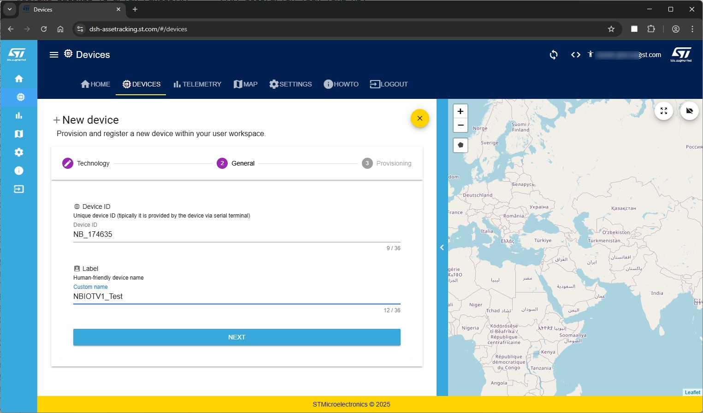

The device is being created, you may need to refresh the page to see it in the devices list.

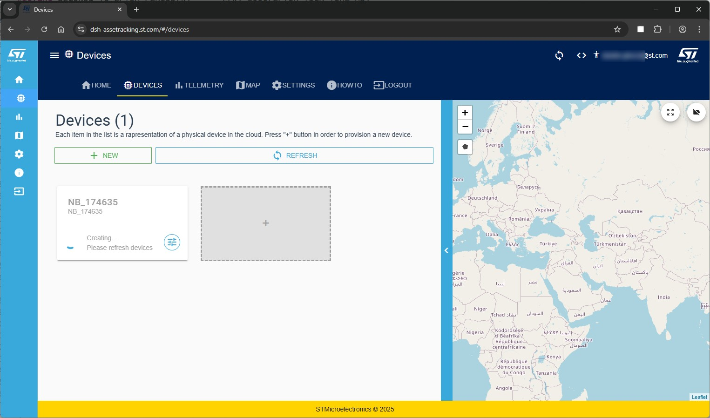

The device is now created, but it has never been seen online yet. Now you may want to recompile the STM32 firmware code with the correct `HTTP_AUTH` and `DASHBOARD_DEVICE_ID` values. then you can flash it on the STEVAL-NBIOTV1 board.

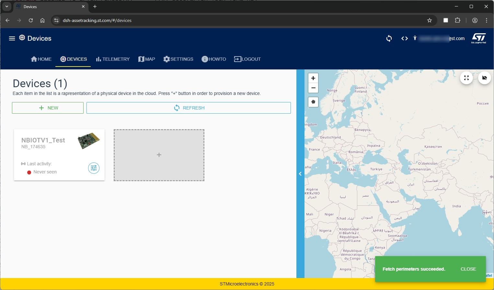

If everything works correctly, after a few moments the device should appear online on the dashboard.
You may want to open a COM port terminal to monitor the application output (see the "Application output" section below).

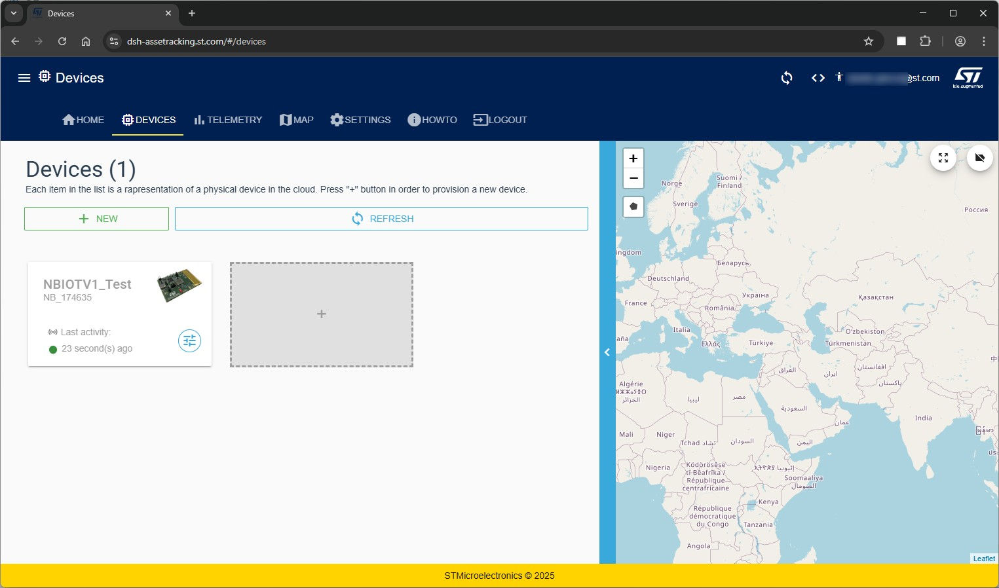

After some time, you should start seeing data arriving on the dashboard.
In the **TELEMETRY** tab, you can select different parameters to visualize (e.g., Temperature, Humidity, Accelerometer, etc.).

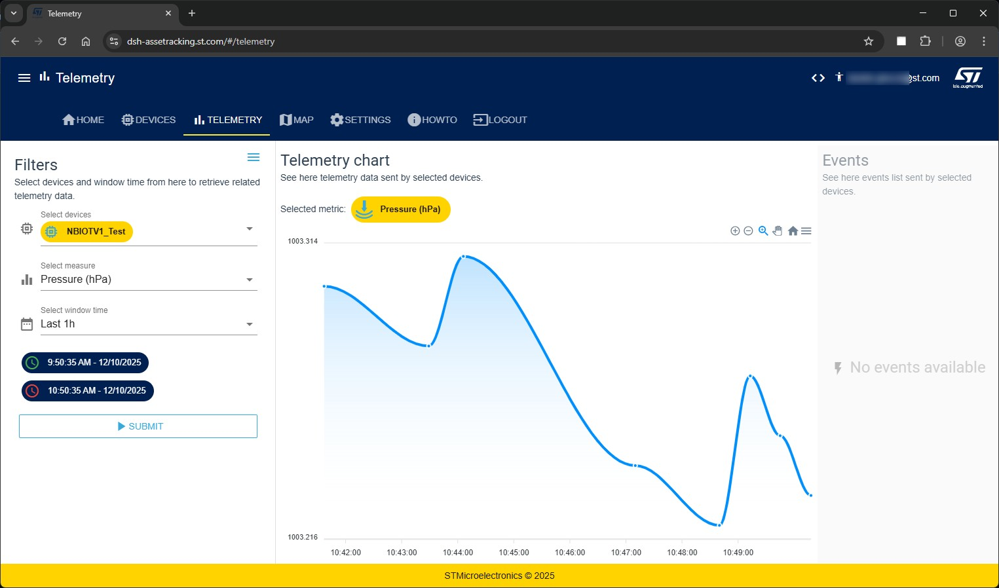

## Application output (optional)
The application will print different kind of messages to the UART terminal.
Messages are identified by the following prefixes:
- '-->' indicates messages from the HOST (STM32) to the Device (ST87M01) - AT commands
- '<--' indicates messages from the Device (ST87M01) to the HOST (STM32) - AT responses and URCs
- '' indicates status messages from the application

Output example:
```
--------- EasyConnect Library STM32U5xx Example ---------
<--
--> AT#NVMRD=5,12,1
<-- #REBOOT_RESET
<--
<-- #SIMST: 1
<--
<-- #NVMRD: 06
<--
--> AT#SLEEPMODE
<-- OK
<--
<-- +CEREG: 2,"","",,,,"",""
<--
<-- OK
<--
<-- +CEREG: 0,"","",,,,"",""
<--
<-- +CEREG: 2,"","",,,,"",""
<--
<-- +CSCON: 1
<--
<-- +CGEV: ME PDN ACT 5
<--
<-- #IPCFG: 5,0,1
<--
<-- +CEREG: 5,"42C7","0073A36F",9,,,"00000101",""

Press the USR button to start the sequence
```

The application automatically tries to connect to the cellular network after boot. Once the connection is established, it waits for the user to press the USR button on the board to start executing the sequence.
If there are problems during the connection phase, please refer to the troubleshooting section of STSW-ST87M01APP Quick Start Guide.
