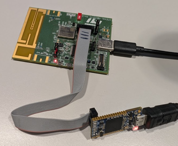
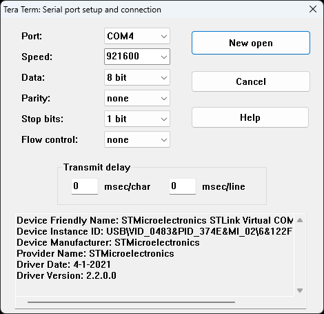

This firmware example runs on the STEVAL-NBIOTV1 board.
The firmware is designed to demonstrate the use of the UDP protocol for low-power applications, specifically in a sleep mode scenario.

# Description
The FW initializes the ST87M01 modem using the EasyConnect library, waits for the modem to establish a connection to the NB-IoT network, and then enters a state machine
to handle sensor data transmission via UDP.

The main task interacts with other tasks via a message buffer, which serves as a shared communication mechanism allowing tasks to exchange data asynchronously and efficiently,
formats sensor data, and sends it to a predefined UDP server. It manages modem resets when communication fails,
enters sleep cycles during periods of inactivity to conserve power, and handles the UDP transfer completion via callbacks.
State machine overview:
- UdpApiState_Init: Waits for network registration (successful registration is determined by receiving a confirmation from the modem) and initializes RTC.
- UdpApiState_GoToSleep: Prepares the system to enter low-power sleep mode.
- UdpApiState_Idle: Waits for sensor data (e.g., temperature, humidity, or pressure) formatted as JSON and initiate UDP transfer when available.
- UdpApiState_TransferSequence: Waits for UDP transfer to complete by monitoring modem responses or using a callback mechanism to confirm successful data transmission.
- UdpApiState_TransferComplete: Handles post-transfer actions before returning to sleep.

The time between sensor data transmissions can be controlled by changing the `APPLICATION_SLEEP_TIME_S` macro in `application.c` file.
You can also select the power state by enabling the corresponding macro:
```c
#define LOW_POWER_MODE_STOP2
//#define LOW_POWER_MODE_SLEEP
```

# Firmware log
To see the firmware output on the PC, you should connect an STLINKV3 debugger to the board and open the STLINK COM port in a terminal program (e.g. PuTTY, TeraTerm, etc.).






The user can also enable the forwarding of the ST87M01 output to the PC by enabling the proper ST87EC_FWD_ST87_RX_MSG macro in `st87ec_debug.h`:
```c
#define ST87EC_FWD_ST87_RX_MSG(PBYTEBUFFER, LENGTH, EOLDETECTED) HAL_UART_Transmit(&huart2, PBYTEBUFFER, LENGTH, 100);
//#define ST87EC_FWD_ST87_RX_MSG(PBYTEBUFFER, LENGTH, EOLDETECTED)
```


